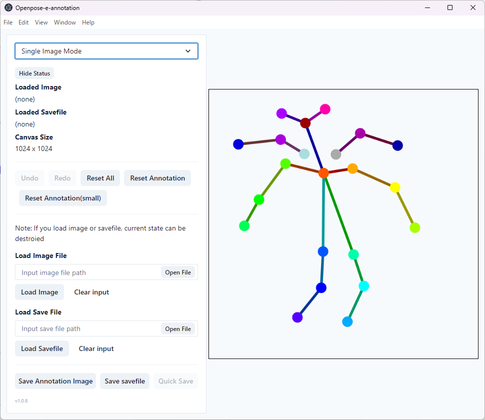

# openpose-e-annotation

Annotation application for [Wing-openpose](https://huggingface.co/claraDolls/Wing_Openpose)  
日本語版 README は[こちら](./docs/README_JP.md)

## Download

Go to [release page](https://github.com/fake-town-child/openpose-e-annotation/releases/tag/1.0.4) and download "openpose-e-annotation-win32-x64.zip"

## What is "Wing-openpose" ?

Wing-openpose is a controlnet for Stable Diffusion XL. This controlnet helps you to generate human illusts with wings.  
For more information and getting core models, please check our [hugging face](https://huggingface.co/claraDolls/Wing_Openpose).

## How to use

Launch `openpose-e-annotation.exe`.

### Create annotation image (for generate)

1. Drag the marker and create posture as you like.
2. You can right click the marker to hide the merker.
3. Click `Save Annotation Image` to save the posture image.

### Create annotation image with reference image (for training)

1. Input the path of reference image to `Load Image File`. (You can click `Open File` to choose file with dialog).
2. Edit annotation.

### Save / Load annotation for re-edit

1. Click `Save savefile` to save the savefile of current annotation (include annotation data and reference image data as you load).
2. Input the path of savefile to `Load Save File` to load saved annotation and you can re-edit the annotation.

Note: Once you save the savefile, you can click `Quick save` to overwrite save the savefile automatically.

### mode

This application has two modes: Single Image Mode and Directory Mode. But directory mode has many bugs. So we recommend you **not to use Directory Mode**.

## Definition of annotation

## LICENSE

MIT License.  
Feel free to fork this repository and improve.
